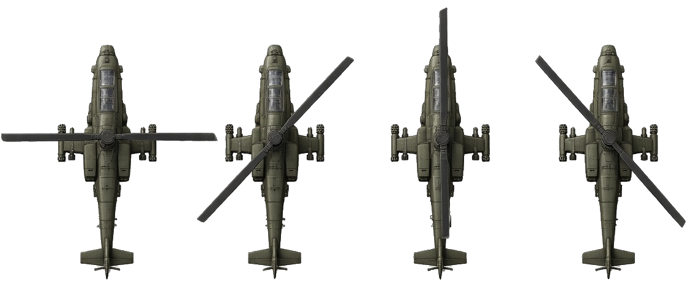
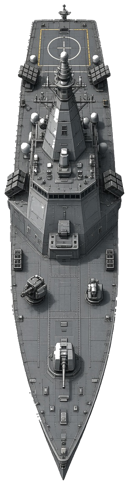
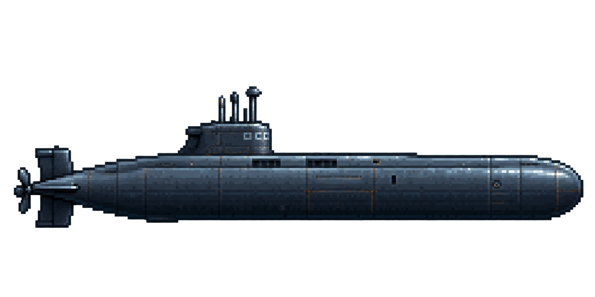
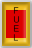
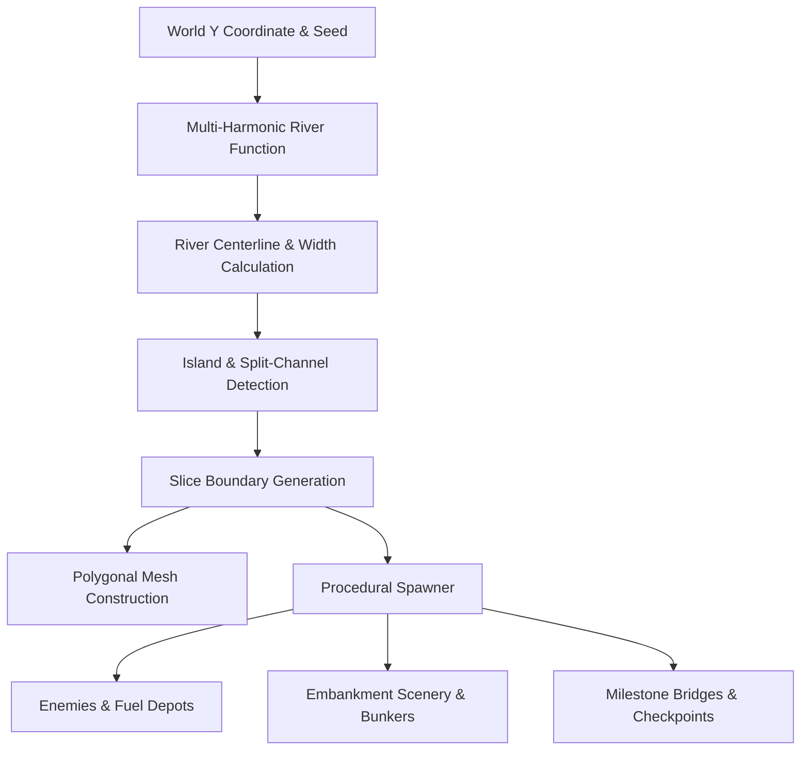

# River Raid - 21st Century Tactical Strike

A modern remake of Activision's classic **River Raid**, built with **Go** and **RayLib** (`raylib-go`).

Featuring procedural river generation, dynamic embankments and islands, 21st-century vector-rendered military graphics, particle effects, multi-stage bridge destruction, tactical fighter HUD, and built-in procedural audio synthesis with sound asset placeholder overrides.

---

## 🎮 Features

- **Procedural River & Embankments:** Infinite curving river system with varied widths, narrow gorges, branching split channels with islands, and beach shorelines.
  - **Stealth Fighter Jet:** F-22 inspired airframe with animated bank roll tilting, twin afterburner flame particles, drop shadows, and wingtip contrails.
  - **AH-64 Attack Helicopters:** Side-patrolling combat choppers with spinning rotor motion blur discs, tail rotors, and weapon pylons.
  - **Stealth Destroyers / Ships:** Modern warship hulls in neutral grey with rotating radar masts, gun turrets, and water wake foam trails.
  - **Hunter Destroyers:** Elite naval units (encountered from Zone 04 onwards) that laterally pursue the player and engage with precision turret fire.
  - **Interceptor Jets:** High-speed Army Green delta-wing enemy jets streaking across the airspace.
  - **Offshore Fuel Depots:** Floating fuel platforms with storage tanks, safety hazard stripes, illuminated "FUEL" signage, and beacon lights.
  - **SAM Missile Sites:** Shore-based radar-guided missile batteries (encountered from Zone 05 onwards) that detect the player and launch persistent heat-seeking missiles.
- **Attack Submarines:** Naval units (encountered from Zone 05 onwards) that cycle between submerged and surfaced states. They fire missiles when surfaced.
- **River Bridges:** Multi-lane truss bridges spanning the river with road markings, crossing military vehicles that engage the player (from Zone 03 onwards), and multi-stage collapse animations when destroyed.
  - **Dynamic Scenery:** Top-down vector-rendered pine/deciduous trees, coastal rocks, radar stations, military bunkers, suburban houses, and industrial buildings populating the embankments.
  - **Particle FX:** Explosive fire bursts, shockwaves, smoke plumes, water splash rings, and flying metal debris.
- **Tactical Flight HUD:** Futuristic cockpit instruments including dynamic fuel gauge with low-fuel alarms, digital score readout, reserve lives, sector indicators, and tactical popups.
- **Procedural Audio & Asset Placeholders:** Pure Go procedural sound synthesizer producing sound effects out of the box, with support for custom `.wav` files in `assets/sounds/`.

---

## 🕹️ Controls

| Key / Action | Function |
| :--- | :--- |
| `W` / `Up Arrow` | Accelerate / Afterburner (increases scroll speed & fuel consumption) |
| `S` / `Down Arrow` | Decelerate / Airbrake (slows flight for precise maneuvering) |
| `A` / `Left Arrow` | Bank Left |
| `D` / `Right Arrow` | Bank Right |
| `Space` / `J` / `Left Click` | Fire Autocannon / Laser (Max 3 on-screen) |
| `P` / `Escape` | Pause / Resume |
| `M` | Mute / Unmute Audio |
| `Enter` / `Space` | Launch Sortie / Restart Mission |

---

## 📖 Player Instructions: Reconnaissance Report

Identify your targets and manage your resources to survive the deep river incursions.

| Sprite | Name | Intelligence / Behavior |
| :---: | :--- | :--- |
|  | **AH-64 Attack Helicopter** | Side-patrolling combat choppers with spinning rotors. Found in all zones. |
|  | **Naval Destroyer** | Standard naval unit patrolling the river. |
|  | **Stealth Destroyer** | Advanced warship with rotating radar. From Zone 04+, they laterally pursue the player and engage with precision turret fire. |
|  | **Interceptor Jet** | High-speed delta-wing jets that streak across the airspace at extreme velocity. |
|  | **SAM Missile Site** | Shore-based radar-guided missile batteries (Zone 05+). Launches persistent heat-seeking missiles when the player is detected. |
|  | **Attack Submarine** | Cycles between submerged (invulnerable) and surfaced (vulnerable). Fires missiles when surfaced (Zone 05+). |
|  | **River Bridge** | Critical milestone targets. From Zone 03+, crossing vehicles engage the player. Destroying a bridge marks a sector checkpoint. |
|  | **Fuel Depot** | Refuels your jet when flying over it. Decelerating increases the fuel intake rate. Can be destroyed for bonus points if fuel is not needed. |

---

## 🌊 How the Procedural World is Generated

The river world in River Raid is generated in real time using a continuous, deterministic procedural generation pipeline implemented in `game/procedural_world.go`. It requires no pre-made tilemaps or sprite sheets.



### 1. Mathematical River Spine & Meander Curves
The river's path is modeled as a continuous mathematical function over the vertical coordinate `WorldY`:

- **Centerline Meander:** Three overlaid sinusoidal harmonics at different frequencies and phase offsets create natural organic curves:
  $$\text{Center}(y) = \text{ScreenMid} + \left( \sin(1.1t) + 0.45\sin(2.7t) + 0.18\sin(5.3t) \right) \times \text{Amplitude}$$
- **Dynamic Width Modulation:** The river continuously breathes between narrow gorges ($\ge 160\text{px}$) and expansive waterways ($\le 440\text{px}$) using secondary harmonic oscillations.
- **Bridge Normalization:** Within $200\text{px}$ of a sector bridge, the procedural generator smoothly straightens the river and widens the banks to ensure clean perpendicular bridge crossings.

### 2. Central Islands & Split Channels
When the river expands beyond $340\text{px}$ and an island frequency harmonic exceeds a set threshold, the algorithm spawns a central island:
- The river splits into two distinct navigable channels (left and right).
- Island geometry is dynamically interpolated between slices, tapering organically at the northern and southern tips.
- Navigational risk increases: players must choose between narrow channels where maneuvering room is limited.

### 3. Procedural Polygonal Mesh & Coastline Rendering
The river is sampled in discrete vertical slices (`SliceStep = 20px`). Each pair of sequential slices is triangulated into 2D polygon strips during rendering:
- **Deep Water:** Flowing multi-layer shimmer waves and depth color.
- **Coastline Contours:** Sandy beach border lines ($3\text{px}$ stroke) with shallow water alpha gradients bordering the river.
- **Embankments:** Layered forest-green land interiors with grass edge highlight bevels.

### 4. Deterministic Spawning & Difficulty Scaling
Entities are generated ahead of the camera using seeded pseudo-random distributions keyed to the vertical slice coordinates:
- **Fuel Depots:** Spawned in open waterways or centered within branching channels to reward accurate navigation.
- **Patrolling Enemies:** Helicopters, ships, and interceptor jets calculate their lateral patrol bounds (`PatrolMinX`, `PatrolMaxX`) directly from the river's dynamic shorelines at that exact coordinate.
- **Section Bridges:** Spawned at fixed milestones (`SectionLength = 3600px`). Bridges link the left and right banks, carrying moving military convoy vehicles.
- **Embankment Scenery:** Pine trees, deciduous trees, coastal rock clusters, radar stations, and military bunkers are procedurally seeded along the land margins.

### 5. High-Performance Analytical Collision & Infinite Streaming
- **$O(1)$ Water Collision Test:** Rather than doing expensive pixel or bitmap reads, `IsPointInWater(x, y)` evaluates coordinates analytically against the sampled slice boundaries to test if the player jet has hit a bank or island.
- **Infinite Generation & Chunk Culling:** Slices and entities are generated ahead of the camera viewport (`CameraY - ScreenHeight * 1.8`) and automatically culled once they scroll behind the screen (`CameraY + ScreenHeight * 1.2`), maintaining constant $O(1)$ memory usage indefinitely.

---

```
riverraid/
├── main.go                     # Entry point & main game loop
├── game/
│   ├── game.go                 # Game state machine & subsystem coordination
│   ├── input.go                # Input handling (Keyboard, Mouse, Gamepad)
│   ├── update.go               # Physics, collisions, scoring & rules
│   ├── display.go              # Vector rendering pipeline & water effects
│   └── procedural_world.go     # Procedural river, island & enemy generation
├── sprites/
│   ├── sprite.go               # Base sprite interface & collision bounds
│   ├── player.go               # Player jet sprite & vector drawing
│   ├── helicopter.go           # Attack helicopter sprite & patrol AI
│   ├── ship.go                 # Naval destroyer sprite & wake trails
│   ├── enemy_jet.go            # High-speed interceptor jet sprite
│   ├── fuel_depot.go           # Refueling station rig sprite
│   ├── bridge.go               # Sector bridge sprite & collapse mechanics
│   ├── bullet.go               # Ballistic projectile sprite
│   ├── particle.go             # Shockwave, fire, smoke & splash particles
│   └── terrain_decoration.go   # Embankment trees, rocks, radar dishes & bunkers
├── audio/
│   ├── audio.go                # Audio manager & asset fallback loader
│   └── synth.go                # Pure Go procedural waveform synthesizer
├── ui/
│   ├── hud.go                  # 21st-century military vector HUD & gauges
│   ├── menu.go                 # Title, GameOver, and Pause screens
│   └── vector_utils.go         # Vector drawing primitives & bevels
└── assets/
    └── sounds/
        └── README.md           # Sound placeholder instructions
```

---

## 🔊 Custom Sound Effects

The game automatically synthesizes all sounds in memory. To substitute your own `.wav` sound files, place any of the following into `assets/sounds/`:

- `shoot.wav`
- `explosion.wav`
- `big_explosion.wav`
- `fuel.wav`
- `low_fuel.wav`
- `extra_life.wav`
- `engine.wav`

---

## 🛠️ Makefile Recipes & Build Commands

A `Makefile` is included to streamline building, running, testing, formatting, and packaging the project.

| Target | Description | Underlying Command |
| :--- | :--- | :--- |
| `make` / `make all` | Build the default game binary. | `go build -ldflags="-s -w" -o riverraid .` |
| `make build` | Compile the optimized game binary. | `go build -ldflags="-s -w" -o riverraid .` |
| `make run` | Compile the game and immediately launch it. | `make build && ./riverraid` |
| `make clean` | Remove compiled executables and `dist/` artifacts. | `rm -f riverraid riverraid.exe && rm -rf dist/` |
| `make check` | Run both code formatting and static analysis checks. | `make fmt && make vet` |
| `make test` | Run all unit and integration test suites. | `go test -v ./...` |
| `make fmt` | Format all Go source files. | `go fmt ./...` |
| `make vet` | Run static analysis on all Go packages. | `go vet ./...` |
| `make deps` | Download and verify module dependencies. | `go mod download && go mod verify` |
| `make tidy` | Tidy dependencies in `go.mod` and `go.sum`. | `go mod tidy` |
| `make package-mac` | Build a standalone macOS `.app` bundle (`dist/RiverRaid.app`). | Builds binary and bundles `Info.plist` + assets |
| `make dist` | Build and package for all platforms (macOS, Linux, Windows). | Cross-compiles binaries and creates archives in `dist/` |
| `make help` | Print a formatted summary of all available make recipes. | Prints target list with descriptions |

---

## 🚀 Running the Game

### Using Make (Recommended)

```bash
# Build and run the game directly
make run

# Run code quality checks
make check

# Clean build artifacts
make clean
```

### Using the Go CLI directly

```bash
# Run directly with Go
go run .

# Build manual executable
go build -o riverraid .
./riverraid
```
